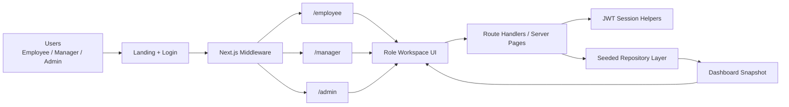
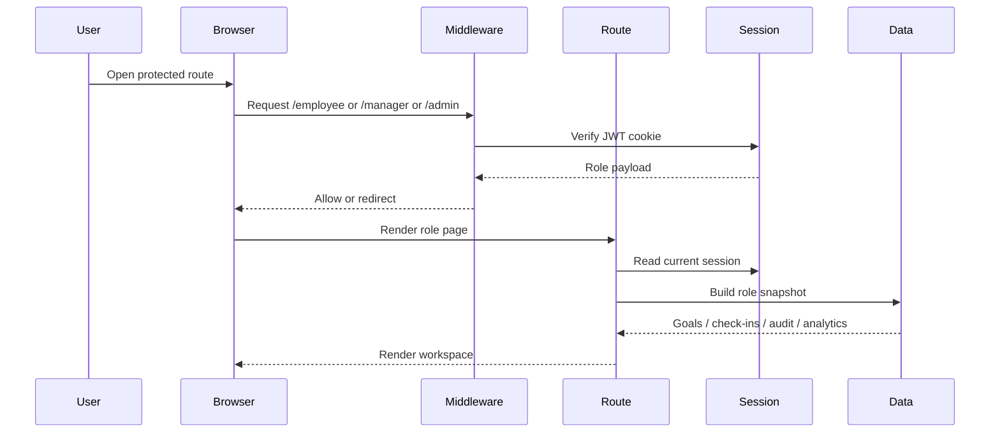
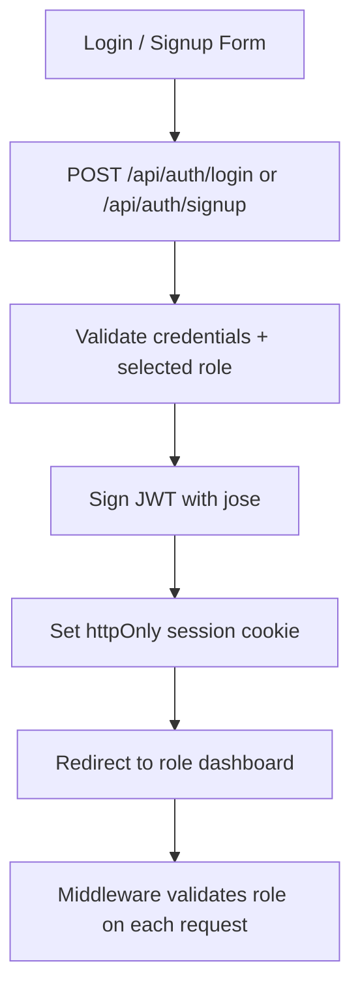
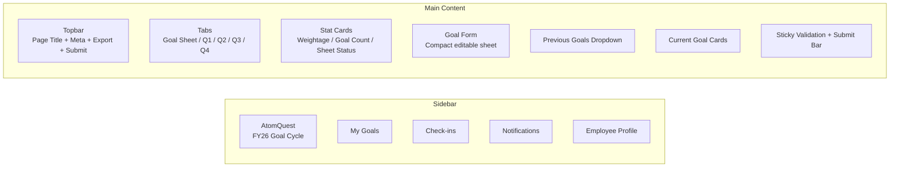
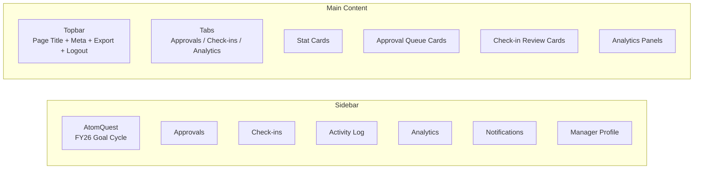
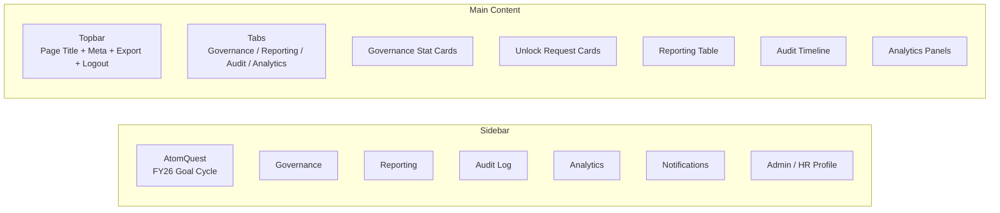
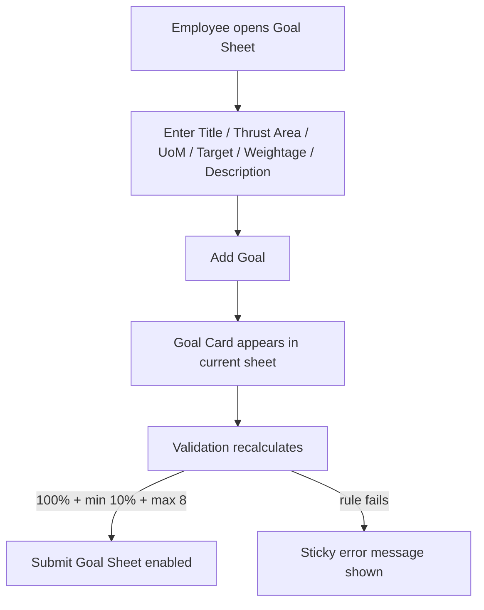
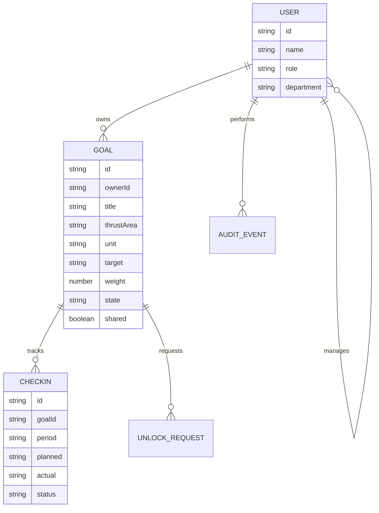

# AtomQuest Goal Portal

AtomQuest is a role-based goal setting and performance tracking portal built for the Atomberg Hackathon problem statement. It replaces fragmented spreadsheets and manual review loops with a single workspace for goal planning, approvals, quarterly check-ins, and governance visibility.

The experience is designed around three clear user journeys:

- `Employee` creates goals, maintains weightage discipline, and updates quarterly progress
- `Manager` reviews submissions, sends work back for rework, and approves locked goals
- `Admin / HR` monitors governance, reporting, audit activity, and cycle health

## Overview

This repo contains a hackathon-ready MVP with:

- role-based dashboards for employee, manager, and admin
- JWT authentication with middleware-backed route guards
- employee goal sheet creation and submission
- manager approval and rework workflows
- admin governance and visibility surfaces
- a shared runtime state layer for cross-role demo flows

The current implementation is optimized for a reliable demo and fast iteration. It is intentionally lightweight, but the structure is ready to evolve into a persistent production system.

## What The Product Solves

Organizations often struggle with goal setting because progress data lives in too many places. Managers review late, employees lack clarity, and HR teams have to reconstruct decision trails during appraisal cycles.

AtomQuest addresses that with a system that makes the lifecycle explicit:

- create goal sheets with structured validations
- submit them for manager review
- approve or return them for rework
- capture quarterly planned vs actual progress
- preserve governance through role separation and audit visibility

## Current Scope

Implemented in the app today:

- landing page with login and signup
- protected dashboards for each role
- employee goal sheet with weightage validation
- manager approval and rework actions
- locked goal protection at the API layer
- admin workspace for governance and reporting views
- analytics and audit-oriented dashboard modules

Current limitations:

- data is runtime-backed, not persisted in a database
- exports are presentation-level UI, not file generation flows yet
- check-in scoring and advanced workflow automation are still partial

## Tech Stack

- `Next.js 15`
- `React 19`
- `TypeScript`
- `Tailwind CSS`
- `jose` for JWT signing and verification
- `Next.js middleware` for role-based route protection

## Demo Credentials

Use these accounts for local testing:

- `employee@atomquest.local` / `employee123`
- `priya@atomquest.local` / `priya123`
- `manager@atomquest.local` / `manager123`
- `admin@atomquest.local` / `admin123`

## Getting Started

1. Install dependencies

```bash
npm install
```

2. Start the development server

```bash
npm run dev
```

3. Open the app

```text
http://localhost:3000
```

Optional:

```bash
JWT_SECRET=your-secret-value
```

If no `JWT_SECRET` is provided, the app falls back to a local development secret.

## Product Flows

### Employee

- open the goal sheet
- add goals with title, thrust area, UoM, target, description, and weightage
- satisfy validation rules before submission
- submit goals for approval
- review status changes and manager comments
- move to quarterly check-in tabs when the cycle window opens

### Manager

- review submitted goal sheets
- adjust target or weightage before approval
- approve goals and lock them
- send a sheet back for rework with comments
- review team progress through check-ins and analytics

### Admin / HR

- monitor governance and cycle health
- inspect reporting summaries
- review audit-oriented activity views
- oversee exception and compliance visibility

## Validation Rules

The employee goal sheet currently enforces:

- total weightage must equal exactly `100`
- minimum weightage per goal is `10`
- maximum number of goals is `8`
- shared-goal behavior can restrict edit access depending on ownership state

## Application Architecture

### High-Level Architecture



### Request Flow



### Auth Architecture



## Wireframes

### Employee Workspace Wireframe



### Manager Workspace Wireframe



### Admin Workspace Wireframe



### Goal Sheet Interaction Wireframe



## Data Model

Core domain entities:

- `User`
- `Goal`
- `CheckIn`
- `AuditEvent`
- `UnlockRequest`
- `ReportRow`
- `AnalyticsSnapshot`
- `DashboardSnapshot`

### Logical Domain Model



## Project Structure

```text
.
├── README.md
├── docs/
│   ├── API_DOCUMENTATION.md
│   ├── ARCHITECTURE.md
│   ├── FEATURES.md
│   ├── PHASE_EXECUTION_PLAN.md
│   └── PROJECT_OVERVIEW.md
├── src/
│   ├── app/
│   │   ├── api/
│   │   ├── admin/
│   │   ├── employee/
│   │   ├── manager/
│   │   ├── landing/
│   │   └── login/
│   ├── components/
│   └── lib/
└── middleware.ts
```

## Key Files

- `src/app/employee/page.tsx` employee route entry
- `src/app/manager/page.tsx` manager route entry
- `src/app/admin/page.tsx` admin route entry
- `src/components/employee-workspace.tsx` employee workspace experience
- `src/components/manager-workspace.tsx` manager approval and review experience
- `src/components/admin-workspace.tsx` admin governance interface
- `src/components/auth-panel.tsx` login and signup UI
- `src/lib/auth.ts` JWT helpers and demo credentials
- `src/lib/runtime-store.ts` shared runtime state used for cross-role demo flows
- `src/lib/server-session.ts` server-side session access
- `middleware.ts` route protection and role-based redirects

## API Surface

Current endpoints:

- `POST /api/auth/login`
- `POST /api/auth/signup`
- `POST /api/auth/logout`
- `GET /api/health`
- `GET /api/dashboard`
- `POST /api/goals/submit`
- `POST /api/goals/[goalId]/review`
- `PATCH /api/goals/[goalId]`

### API Summary

| Endpoint | Method | Purpose |
| --- | --- | --- |
| `/api/auth/login` | `POST` | authenticate user and issue JWT |
| `/api/auth/signup` | `POST` | create a demo session for a chosen role |
| `/api/auth/logout` | `POST` | clear the session cookie |
| `/api/health` | `GET` | health check |
| `/api/dashboard` | `GET` | return the dashboard snapshot for the current session |
| `/api/goals/submit` | `POST` | submit an employee goal sheet |
| `/api/goals/[goalId]/review` | `POST` | approve or send a goal sheet for rework |
| `/api/goals/[goalId]` | `PATCH` | update editable goals; reject locked-goal bypass attempts |

## Access Model

- `Employee` can only access `/employee`
- `Manager` can only access `/manager`
- `Admin` can only access `/admin`
- middleware guards routes before render
- server routes also validate the active session role

## Where To Go Next

Strong next upgrades for this codebase:

- move runtime state to `PostgreSQL + Prisma`
- implement persistent quarterly check-ins and scoring
- wire CSV / Excel export to real generated files
- add shared-goal ownership sync
- expand audit logging for every write path
- integrate Microsoft Entra ID, Teams, and email notifications

## Related Docs

- [Architecture](./docs/ARCHITECTURE.md)
- [Project Overview](./docs/PROJECT_OVERVIEW.md)
- [API Documentation](./docs/API_DOCUMENTATION.md)
- [Features](./docs/FEATURES.md)
- [Phase Execution Plan](./docs/PHASE_EXECUTION_PLAN.md)
