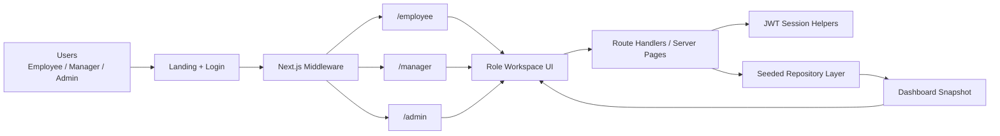
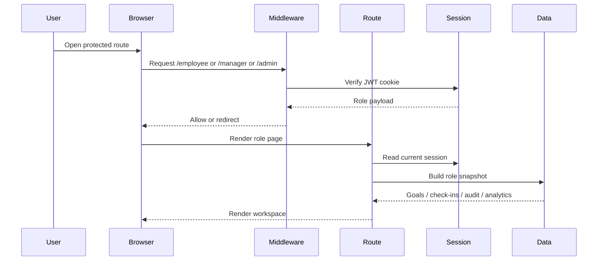
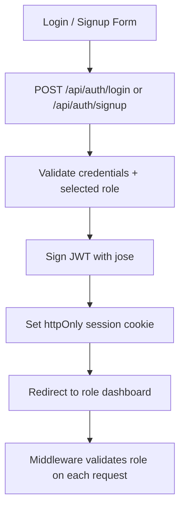
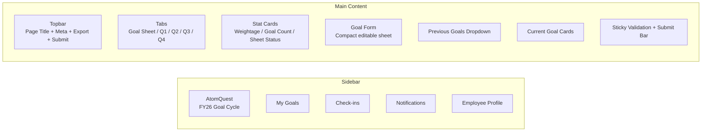
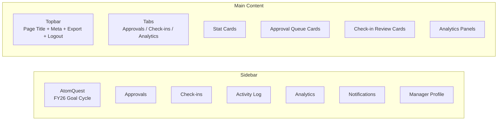
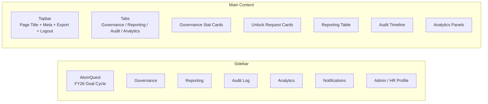
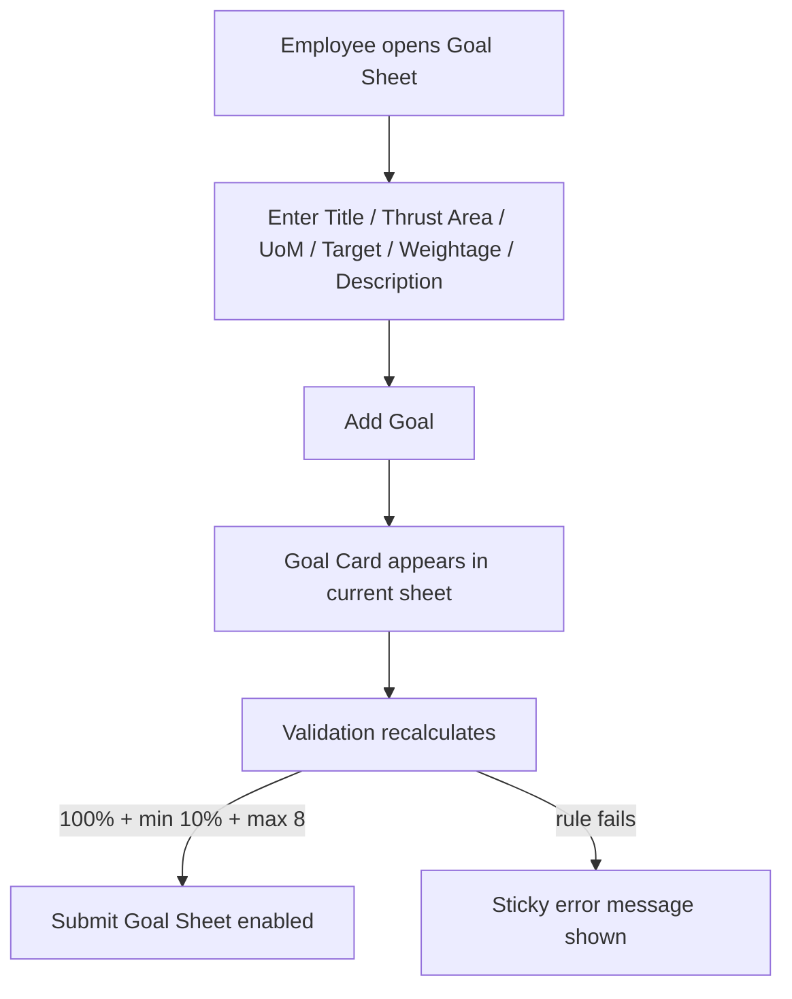
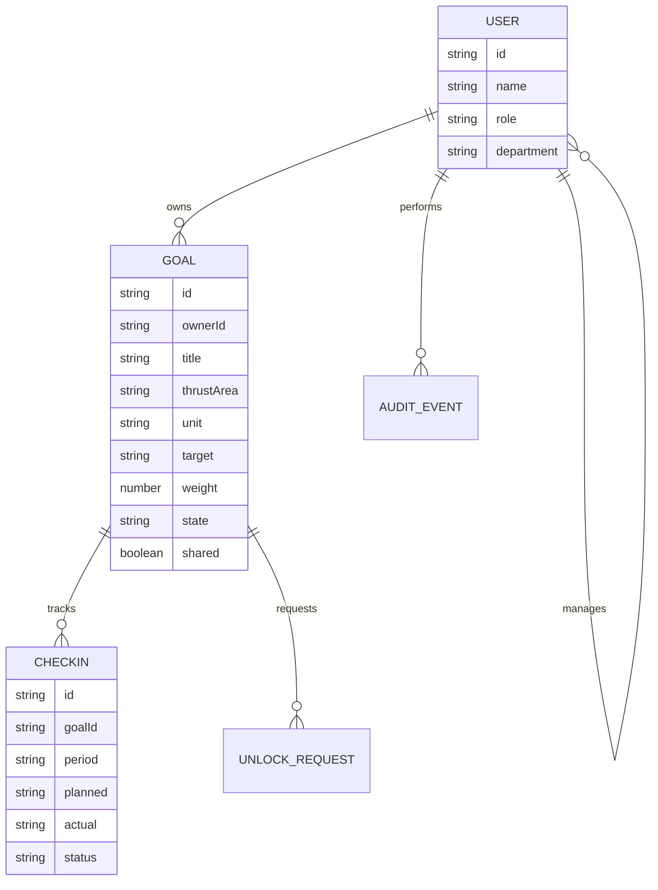

# AtomQuest Goal Portal

<<<<<<< ours
AtomQuest is an in-house goal setting and tracking portal built for the Atomberg Hackathon 1.0 problem statement. The current implementation focuses on the early execution phases:

- `Phase 0`: scope, architecture, and domain design
- `Phase 1`: application foundation, role-aware shell, and seeded portal data

## Current Status

The repository now contains:

- project documentation aligned to the BRD
- a `Next.js + TypeScript` application scaffold
- role-based dashboards for `Employee`, `Manager`, and `Admin / HR`
- seeded mock data representing goals, approvals, check-ins, and audit logs
- starter API routes for health and dashboard data

## Quick Start

1. Install dependencies with `npm install`
2. Start the app with `npm run dev`
3. Open `http://localhost:3000`

Use the role switcher in the UI to review the three demo journeys.

## Project Structure

- `docs/` project planning, architecture, feature tracking, and API notes
- `src/app/` Next.js app router pages and API routes
- `src/components/` reusable dashboard UI building blocks
- `src/lib/` domain types and seeded portal data

## Next Phases

- `Phase 2`: employee goal creation and submission workflow
- `Phase 3`: manager approval workflow
- `Phase 4`: quarterly achievement tracking and check-ins
- `Phase 5`: admin governance, reporting, and audit views

See [docs/PHASE_EXECUTION_PLAN.md](/Users/anjaliprajapati/Atomberg Project/Atomberg-Hackathon-Project/docs/PHASE_EXECUTION_PLAN.md) for the detailed phase plan.
=======
AtomQuest Goal Portal is a role-based internal goal setting and tracking system built for the Atomberg Hackathon problem statement. The app covers three role journeys:

- `Employee`: create and submit goals, track quarterly check-ins, review prior goals
- `Manager`: review approvals, conduct team check-ins, track progress health
- `Admin / HR`: manage governance, reporting, audit visibility, and cycle oversight

The current implementation is optimized for a hackathon MVP: clean role-specific dashboards, seeded data for deterministic demos, JWT-based auth, and a clear upgrade path to persistent backend workflows.

## Problem Statement

Organizations that rely on spreadsheets, emails, and fragmented review processes struggle with:

- low visibility into employee goal progress
- weak manager accountability during review cycles
- inconsistent tracking of planned vs actual achievement
- limited auditability for approval, rework, and unlock events

AtomQuest solves that by providing a structured portal for:

- goal creation and weightage validation
- manager approval and rework
- quarterly achievement capture
- admin governance and audit oversight

## Live Scope

Implemented in the current repo:

- public landing page with login and signup
- JWT auth with role selection
- role-guarded routes for `employee`, `manager`, and `admin`
- role-specific dashboards with compact workspace layouts
- employee goal sheet creation flow with validation
- quarterly check-in views
- manager approval and review views
- admin governance, reporting, and audit dashboards
- seeded demo data for stable demos

Current limitations:

- data is still in-memory / seeded, not persisted to a database
- write actions are UI-local and reset between sessions
- export buttons are present in the UI but are not yet wired to file generation

## Tech Stack

- `Next.js 15` with App Router
- `React 19`
- `TypeScript`
- `Tailwind CSS 4`
- `jose` for JWT signing and verification
- `Next.js middleware` for route protection
- seeded in-memory data layer in `src/lib/demo-data.ts`

## Demo Credentials

Use any of these to test role journeys:

- `employee@atomquest.local` / `employee123`
- `manager@atomquest.local` / `manager123`
- `admin@atomquest.local` / `admin123`

## Local Setup

1. Install dependencies:

```bash
npm install
```

2. Start the dev server:

```bash
npm run dev
```

3. Open:

```text
http://localhost:3000
```

Optional environment variable:

```bash
JWT_SECRET=your-secret-value
```

If `JWT_SECRET` is not provided, the app falls back to a local development secret.

## Role Journeys

### Employee

- open `My Goals`
- create goals with `title`, `thrust area`, `UoM`, `target`, `weightage`, and `description`
- satisfy validation rules before submission
- review prior seeded goals from the previous-goals dropdown
- switch to quarter tabs for check-ins

### Manager

- review submitted goals
- edit target and weightage before approval
- approve or send back for rework
- review check-in updates
- inspect analytics and team progress

### Admin / HR

- review unlock requests
- inspect governance cards
- open reporting summaries
- inspect audit log activity
- review organization-level analytics

## Validation Rules

The employee goal sheet enforces:

- total weightage must equal exactly `100`
- minimum weightage per goal is `10`
- maximum number of goals is `8`
- shared goals keep `title` and `target` read-only for recipient view

## Application Architecture

### High-Level Architecture



### Request Flow



### Auth Architecture



## Wireframes

### Employee Workspace Wireframe



### Manager Workspace Wireframe



### Admin Workspace Wireframe



### Goal Sheet Interaction Wireframe



## Data Model

Current typed entities in `src/lib/types.ts`:

- `User`
- `Goal`
- `CheckIn`
- `AuditEvent`
- `UnlockRequest`
- `ReportRow`
- `AnalyticsSnapshot`
- `DashboardSnapshot`

### Logical Domain Model



## Folder Structure

```text
.
├── README.md
├── docs/
│   ├── API_DOCUMENTATION.md
│   ├── ARCHITECTURE.md
│   ├── FEATURES.md
│   ├── PHASE_EXECUTION_PLAN.md
│   └── PROJECT_OVERVIEW.md
├── src/
│   ├── app/
│   │   ├── api/
│   │   ├── admin/
│   │   ├── employee/
│   │   ├── manager/
│   │   ├── landing/
│   │   └── login/
│   ├── components/
│   └── lib/
└── middleware.ts
```

## Important Files

- `src/app/employee/page.tsx`: employee route entry
- `src/app/manager/page.tsx`: manager route entry
- `src/app/admin/page.tsx`: admin route entry
- `src/components/employee-workspace.tsx`: employee workspace UI
- `src/components/manager-workspace.tsx`: manager workspace UI
- `src/components/admin-workspace.tsx`: admin workspace UI
- `src/components/auth-panel.tsx`: login and signup form
- `src/lib/auth.ts`: JWT helpers and demo credentials
- `src/lib/server-session.ts`: server-side session reader
- `src/lib/demo-data.ts`: seeded mock data
- `middleware.ts`: route protection and role redirects

## API Surface

Current endpoints:

- `POST /api/auth/login`
- `POST /api/auth/signup`
- `POST /api/auth/logout`
- `GET /api/health`
- `GET /api/dashboard?role=employee|manager|admin`

### API Summary

| Endpoint | Method | Purpose |
| --- | --- | --- |
| `/api/auth/login` | `POST` | authenticate demo user and issue JWT |
| `/api/auth/signup` | `POST` | create a demo session for chosen role |
| `/api/auth/logout` | `POST` | clear session cookie |
| `/api/health` | `GET` | health check |
| `/api/dashboard` | `GET` | role-based dashboard snapshot |

Planned next endpoints:

- `POST /api/goals`
- `PATCH /api/goals/:id`
- `POST /api/goals/:id/submit`
- `POST /api/goals/:id/approve`
- `POST /api/goals/:id/rework`
- `POST /api/check-ins`
- `PATCH /api/check-ins/:id`
- `GET /api/reports/achievement`

## Role Access Rules

- `Employee` can only access `/employee`
- `Manager` can only access `/manager`
- `Admin` can only access `/admin`
- middleware redirects role mismatches back to the correct dashboard
- route-level checks also enforce role correctness on the server

## Current UX Decisions

- each role uses a dedicated sidebar with only relevant sections
- employee current sheet is editable and separate from previously seeded goals
- previous goals are visible through a dropdown preview instead of blocking the active draft
- manager and admin dashboards surface only review/governance tasks relevant to their role

## Future Improvements

- replace seeded repository with PostgreSQL + Prisma
- persist goal creation and approvals across sessions
- wire export buttons to CSV / Excel download
- implement real approval workflow state syncing across roles
- add Microsoft Entra ID / Teams / email integrations
- support audit filters and analytics drilldowns

## Hackathon Submission Checklist

- hosted demo URL
- source repository
- architecture diagram
- working journey for employee, manager, and admin
- role-aware login credentials

## Related Docs

- [Architecture](./docs/ARCHITECTURE.md)
- [Project Overview](./docs/PROJECT_OVERVIEW.md)
- [API Documentation](./docs/API_DOCUMENTATION.md)
- [Features](./docs/FEATURES.md)
- [Phase Execution Plan](./docs/PHASE_EXECUTION_PLAN.md)

>>>>>>> theirs
