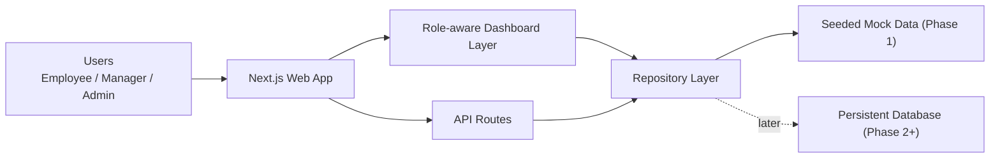

# System Architecture

## Architecture Overview
AtomQuest is being implemented as a role-aware web portal with a layered structure that lets the team demonstrate complete user journeys early, then swap seeded data for persistent storage in later phases.

The foundation is intentionally optimized for hackathon speed:

- `Next.js App Router` for UI and lightweight API routes
- typed domain models shared between UI and APIs
- a repository layer that currently serves seeded data
- a clean path to replace mock repositories with database-backed ones later

## Component Diagram

## Data Flow
1. A user selects or signs in as a role.
2. The dashboard requests portal data based on that role.
3. The repository resolves seeded goals, approvals, check-ins, and audit events.
4. The UI renders role-specific actions, summary metrics, and workflow queues.
5. Future phases will replace the repository source without changing the dashboard contract.

## Key Components
1. **App Shell**
   - Description: shared dashboard shell and navigation
   - Responsibilities: layout, role switcher, phase status, cross-role consistency
   - Dependencies: Next.js app router, dashboard components

2. **Role Dashboards**
   - Description: tailored views for Employee, Manager, and Admin / HR
   - Responsibilities: surface relevant metrics, queues, validation reminders, and governance data
   - Dependencies: seeded domain snapshot

3. **Repository Layer**
   - Description: one place to request portal data for a role
   - Responsibilities: shape domain objects into UI-friendly snapshots
   - Dependencies: seeded mock data in Phase 1

4. **API Routes**
   - Description: starter JSON endpoints for health and dashboard data
   - Responsibilities: basic integration contract for frontend and later automation
   - Dependencies: repository layer

## Database Schema
The Phase 1 implementation uses typed in-memory records. The persistent model is planned around these entities:

| Entity | Purpose |
| --- | --- |
| `User` | employee, manager, or admin identity and reporting structure |
| `GoalCycle` | yearly or quarterly cycle windows |
| `Goal` | goal definition, weightage, target, UoM, and status |
| `GoalShare` | links shared goals across multiple employees |
| `CheckIn` | planned vs actual achievement updates by period |
| `ManagerComment` | structured manager observations during review/check-ins |
| `AuditLog` | immutable activity history for governance |

## API Endpoints
- `GET /api/health`
- `GET /api/dashboard?role=employee|manager|admin`

Planned next endpoints:

- `POST /api/goals`
- `PATCH /api/goals/:id`
- `POST /api/goals/:id/submit`
- `POST /api/goals/:id/approve`
- `POST /api/goals/:id/rework`
- `POST /api/check-ins`
- `GET /api/reports/achievement`

## External Integrations
- `Phase 1`: none required for local demo
- `Phase 5+`: Microsoft Entra ID, email / Teams notifications, escalation workflows

## Security Considerations
- [x] Authentication strategy: demo role switcher now, extensible auth later
- [x] Authorization strategy: role-based dashboard and endpoint gating by role
- [ ] Data encryption: to be handled once persistent storage is introduced
- [x] API security: controlled response shapes and role validation on request inputs

## Deployment Strategy

- local development through `npm run dev`
- hosted demo on Vercel or equivalent
- seeded data guarantees deterministic demo behavior even before persistence is added

---

**Last Updated:** May 17, 2026
